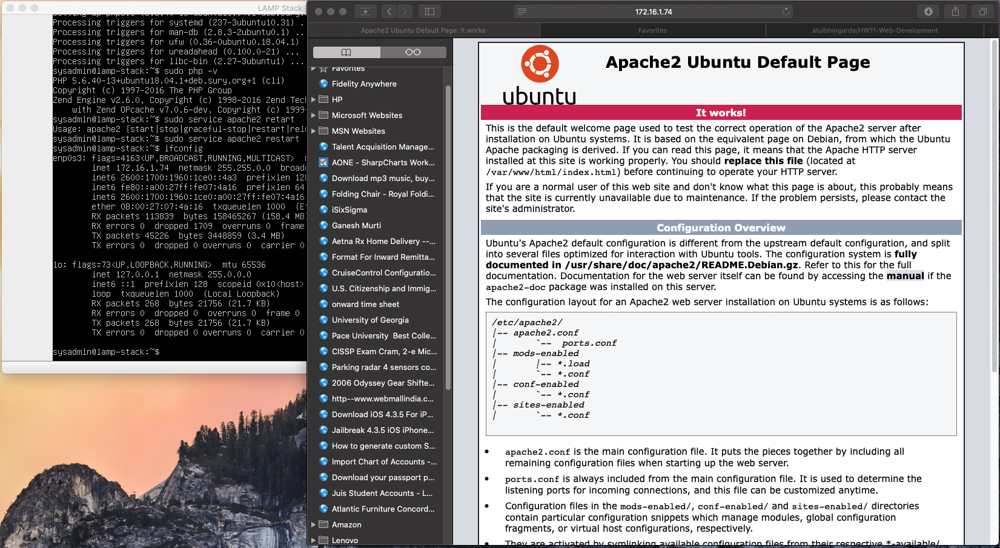
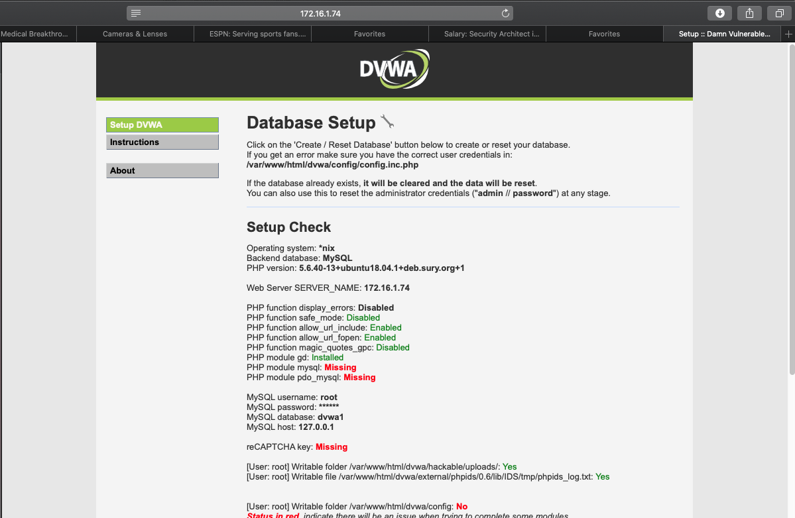

# Setting Up a Web Application

In this homework, you'll use your knowledge of the LAMP stack to build and serve a real web application. In particular, you'll use it to serve a _vulnerable_ web application, called DVWA.

Soon, you'll use DVWA to study web vulnerabilities. Setting it up from scratch will help give you thorough context on how these vulnerabilities affect the underlying host.

This homework requires that you setup a server from scratch. 
There is an Ubuntu VM located [here](https://drive.google.com/a/2tor.com/file/d/1uLLg9tx7VoexcXBbVWb_zzYUKIZMFVZU/view?usp=sharing) to get you started. 

The login credentials are:
- Username: `sysadmin`
- Password: `cybersecurity`

Make sure that this VM's network settings are set to `Bridged Adapter`.
- In Virtual box, after you import the VM, choose it on the left and click on `settings` at the top.
    - Choose the `Network` payne
        - For the drop down labeled `Attached to:` choose `Bridged Adapter`
            - For the dropdown labeled `Name` choose your `wifi` card from the list.
            - Click `OK` to save.

**Good luck!**

## Instructions

In order for DVWA to work properly, we have to install an old version of PHP on the LAMP (php5.6)

Add in repository
- `sudo add-apt-repository ppa:ondrej/php`
- Press `Enter`

Update the repository
- `sudo apt-get update`

Upgrade the repository
- `sudo apt-get upgrade`
- Type `Y` and press enter

Install php5.6
- `sudo apt-get install php5.6`
- Type `Y` and press enter

Install PHP modules
- `sudo apt-get install php5.6-mbstring php5.6-mcrypt php5.6-mysql php5.6-xml`
- Type `Y` and press enter

Check php version is php5.6
- `sudo php -v`
- - You should see PHP 5.6 in the output

Restart apache2 service
- `sudo service apache2 restart`

### Test Apache

Get the IP address of the VM
- `ifconfig` or `ip addr`

On your local machine (not inside the VM):
Open a web browser and enter the IP address of your VM into the address bar. 

- You should get the apache home page titled, 'Apache2 Ubuntu Default Page'

### Getting DVWA

Back on your VM:

You'll get started by downloading the files needed to run DVWA.
- `cd /var/www`
- `sudo wget https://github.com/ethicalhack3r/DVWA/archive/master.zip`

### Download Unzip

Unzip is needed to unzip (extract) the DVWA ZIP file

Download and Install Unzip
- `sudo apt-get install unzip`

Unzip the Unzip ZIP file to /var/www/html
- `sudo unzip master.zip -d html/`

Rename DVWA-master folder to dvwa
- `cd html`
- `sudo mv DVWA-master dvwa`

Rename DVWA config file.
- `cd dvwa`
- `sudo mv config/config.inc.php.dist config/config.inc.php`

### Open the DVWA Setup Page

Back on your local machine, navigate to:

- `<your-VM's-IP>/dvwa/setup.php`

### Correct some of the DVWA Setup page errors

As you can see from this page, there are some items in red that need to be corrected. Follow the steps below to correct those errors before creating the database.

Allow url includes
- `sudo nano /etc/php/5.6/apache2/php.ini`
- In nano, press `Control + w` key and type `allow_url_include` and change from `Off` to `On`.

Restart apache2 service
- `screa`

Install php-gd
 - `sudo apt-get install php5.6-gd`

Restart apache2 service
- `sudo service apache2 restart`

Edit the group and permissions of specific DVWA folders and files
- `sudo chgrp www-data hackable/uploads`
- `sudo chgrp www-data /var/www/html/dvwa/external/phpids/0.6/lib/IDS/tmp/phpids_log.txt`
- `sudo chgrp www-data /var/www/html/dvwa/config`

- `sudo chmod g+w hackable/uploads`
- `sudo chmod g+w /var/www/html/dvwa/external/phpids/0.6/lib/IDS/tmp/phpids_log.txt`
- `sudo chmod g+w /var/www/html/dvwa/config`

Restart apache2 service
- `sudo service apache2 restart`

Check DVWA Setup page
- Go to `<your-VM's-IP>/dvwa/setup.php` and make sure some of the items in red are now corrected based on the steps above.
- Do not worry about the CAPCHA items, that can be ignored.

### Configuring the Database
Back on your VM:

Now we need to install mysql
- `sudo apt-get install mysql-server`

The DVWA config file asks for a MySQL username and password. Since one isn't setup yet, we are going to create a user and grant that user privileges to the dvwa database we will be creating later.

Enter mysql:
`sudo mysql`

Create MySQL username and password
- `CREATE USER dvwa@localhost IDENTIFIED BY 'abc123' ;`
- `GRANT ALL PRIVILEGES ON dvwa.* TO dvwa@localhost ;`

Exit mysql:
`exit`

Update mysql section in the DVWA config.inc.php file
 - `sudo nano /var/www/html/dvwa/config/config.inc.php`
- Edit the Mysql username to `dvwa` and password to `abc123`
- Save and exit config.inc.php file

Restart apache2 service
- `sudo service apache2 restart`

### Creating the Database

Since we have the MySQL username and password created along with the permissions set for the user, we can now create the MySQL database for DVWA.

Back on your local machine.

- Go to `<your-VM's-IP>/dvwa/setup.php`
- Click **Create/Reset Database** button at the bottom. If successful, you will see output showing the database was successfully created at the bottom.
- If the database was successfully created, and if the page doesn't automatically redirect you, go to the `<your-VM's-IP>/dvwa/login/php` page and login using the following default credentials:
 - username: `admin`
 - password: `password`

## Submission
When you're done, submit the following files in a tarball:
- `/var/www/html/config/config.inc.php`
- Screenshot of the DVWA welcome page after you successfully login

